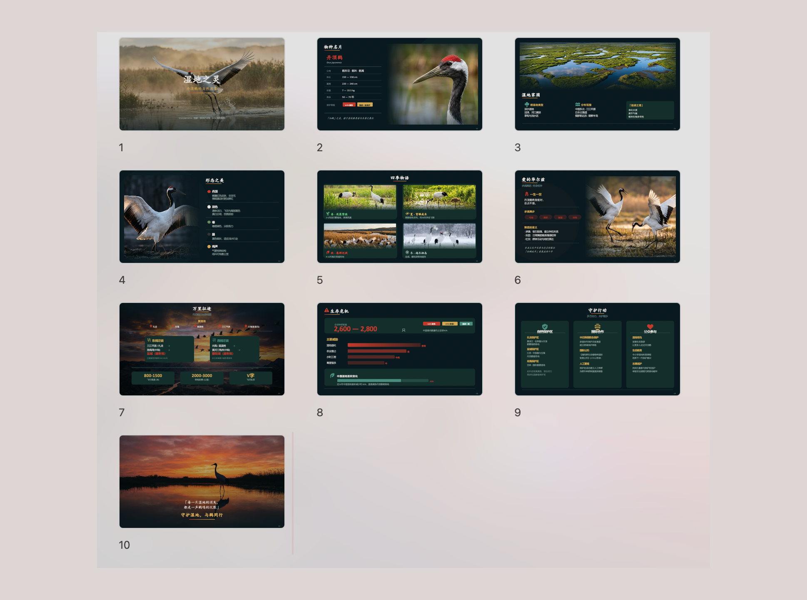
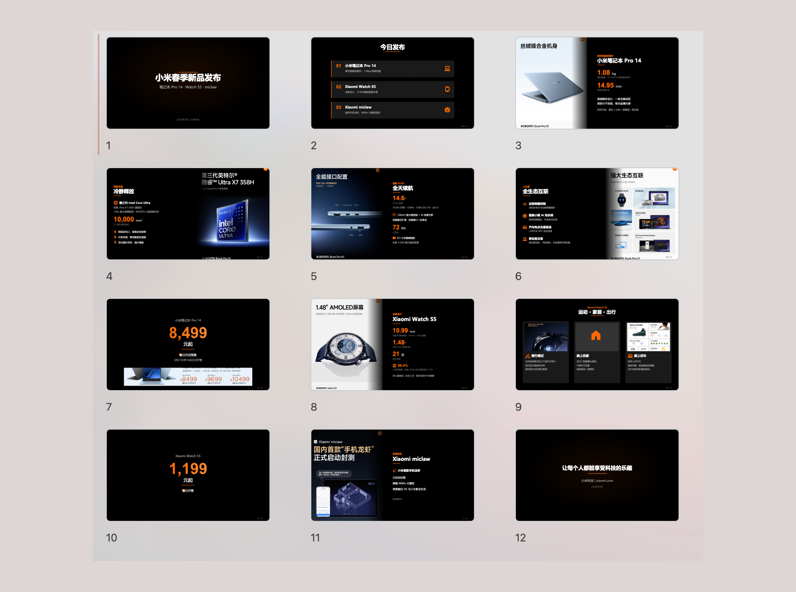

# PPT Master — AI 生成原生可编辑 PPTX，支持任意文档输入

[](https://opensource.org/licenses/MIT)

[English](./README.md) | 中文

<p align="center">
  <a href="https://github.com/MorningStar0709/ppt-master-enhanced"><strong>仓库主页</strong></a> ·
  <a href="./examples/"><strong>示例</strong></a> ·
  <a href="./docs/zh/faq.md"><strong>常见问题</strong></a> ·
  <a href="./docs/zh/technical-design.md"><strong>技术设计</strong></a>
</p>

> **仓库说明** — 本仓库是基于原始 PPT Master 项目的独立维护衍生版本，由 [MorningStar0709](https://github.com/MorningStar0709) 维护，不代表上游官方仓库。项目继续采用 MIT 协议，并保留上游署名与许可证信息。

---

丢进一份 PDF、DOCX、网址或 Markdown，拿回一份**原生可编辑的 PowerPoint**——真正的形状、真正的文本框、真正的图表，不是图片。点击任何元素即可编辑。

**[为什么选 PPT Master？](./docs/zh/why-ppt-master.md)**

市面上不缺 AI PPT 工具——缺的是一个**生成出来的 PPT 能真正拿去用**的工具。我每天都在做 PPT，但大部分产品输出的是图片或网页截图，好看但改不了；要么就是基础到只有文本框和列表。你还得按月充会员，把文件传到别人的服务器上，被锁在某个平台里。

PPT Master 不一样：

- **真正的 PPT** — 如果一个文件在 PowerPoint 里打不开、不能编辑，它就不应该被叫做 PPT。PPT Master 输出的每个元素都能直接点击修改
- **成本透明可控** — 工具免费开源，主要成本来自你自己的 AI 编辑器调用。由于这个增强版加入了更严格的检查点和审查门禁，实际时间与 token 消耗通常会高于上游项目
- **数据不出本地** — 你的文件不应该为了做一份 PPT 就被上传到别人的服务器。除与 AI 模型的对话外，全流程在你的电脑上完成
- **不锁定平台** — 你的工作流不应该被任何一家公司绑架。Claude Code、Cursor、VS Code Copilot 等均可驱动；Claude、GPT、Gemini、Kimi 等模型均可使用

但与上游项目相比，这个增强版是明确用速度和 token 消耗换取可控性与可靠性的。你应预期它会更慢、也更耗 token，因为流程中加入了模板选择、8 项确认、逐页串行生成并即时自检，以及导出前阻塞式的最终 SVG 审批门禁。

**示例见 [`examples/`](./examples/)** — 15 个项目，229 页

## 效果展示

<table>
  <tr>
    <td align="center"><br/><sub><b>杂志风</b> — 暖色调，大图排版，生活方式感</sub></td>
    <td align="center"><br/><sub><b>学术风</b> — 严谨结构，数据图表，论文答辩场景</sub></td>
  </tr>
  <tr>
    <td align="center"><br/><sub><b>暗色艺术风</b> — 电影感深色背景，美术馆陈列感</sub></td>
    <td align="center"><br/><sub><b>自然纪录风</b> — 沉浸式摄影，简洁信息层级</sub></td>
  </tr>
  <tr>
    <td align="center"><br/><sub><b>科技 / SaaS 风</b> — 白底卡片，定价表格，产品说明书</sub></td>
    <td align="center"><br/><sub><b>发布会风</b> — 高对比度，参数突出，苹果/小米发布会感</sub></td>
  </tr>
</table>

---

## 当前维护者

这个仓库是基于原始 PPT Master 做了大量定制增强后的独立维护版本，重点加强了更严格的生产流程、Windows/Trae 环境约束，以及导出前的 SVG 审查门禁。

相较于上游版本，这个分支更强调 review/revision 体系、额外校验器、稳定项目路径规则，以及更保守的导出阻塞机制，以提高真实交付场景下的可靠性。

这也意味着它在实际使用中通常比上游版本更慢、token 消耗更高。它追求的是更可控的交付质量，而不是最快速地产出第一版草稿。

🐙 维护者： [MorningStar0709](https://github.com/MorningStar0709)

---

## 快速开始

### 1. 前置条件

**你需要先安装 Conda，并在 `ppt-master` 环境中使用 Python 3.10+。** 本项目默认通过 `conda run -n ppt-master ...` 执行全部命令。

| 依赖 | 是否必须 | 用途 |
|------|:--------:|------|
| [Miniconda / Conda](https://docs.conda.io/en/latest/miniconda.html) | ✅ **必需** | 创建并运行 `ppt-master` 环境 |
| [Python](https://www.python.org/downloads/) 3.10+ | ✅ **必需** | 在 Conda 环境中使用的运行时版本 |

> **一句话总结** — 安装 Conda，创建 `ppt-master` 环境并使用 Python 3.10+，然后运行 `conda run -n ppt-master pip install -r requirements.txt`。

<details open>
<summary><strong>Windows</strong> — 请看专门的手把手安装指南 ⚠️</summary>

Windows 需要一些额外步骤（PATH 设置、执行策略等）。我们为 Windows 用户写了一份**手把手安装指南**：

**📖 [Windows 安装指南](./docs/zh/windows-installation.md)** — 从零到跑通第一份 PPT，10 分钟搞定。

简要流程：安装 Miniconda → `conda create -n ppt-master python=3.10 -y` → `conda run -n ppt-master pip install -r requirements.txt`。
</details>

<details>
<summary><strong>macOS / Linux</strong> — 安装即用</summary>

```bash
# macOS
brew install --cask miniconda
conda create -n ppt-master python=3.10 -y
conda run -n ppt-master pip install -r requirements.txt

# Ubuntu / Debian
curl -fsSL https://repo.anaconda.com/miniconda/Miniconda3-latest-Linux-x86_64.sh -o miniconda.sh
bash miniconda.sh -b -p "$HOME/miniconda3"
"$HOME/miniconda3/bin/conda" create -n ppt-master python=3.10 -y
conda run -n ppt-master pip install -r requirements.txt
```
</details>

<details>
<summary><strong>边缘场景备用方案</strong> — 99% 的用户用不到</summary>

下面两个外部程序只作为极端场景的兜底。**绝大多数用户根本不需要装**，只有遇到以下具体场景才装：

| 备用方案 | 只在以下情况才装 |
|---------|-----------------|
| [Node.js](https://nodejs.org/) 18+ | 你需要抓取微信公众号文章，**且**你的 Python + 系统 + CPU 组合下 `curl_cffi`（`requirements.txt` 里已默认安装）没有预编译 wheel。正常安装下 `web_to_md.py` 已能通过 `curl_cffi` 直接抓微信。 |
| [Pandoc](https://pandoc.org/) | 你需要转 `.doc`、`.odt`、`.rtf`、`.tex`、`.rst`、`.org`、`.typ` 这些小众格式。`.docx`、`.html`、`.epub`、`.ipynb` 已由 Python 原生处理，不需要 pandoc。 |

```bash
# macOS（仅在上述条件成立时才装）
brew install node
brew install pandoc

# Ubuntu / Debian
sudo apt install nodejs npm
sudo apt install pandoc
```
</details>

### 2. 选择 AI 编辑器

| 工具 | 推荐度 | 说明 |
|------|:------:|------|
| **[Claude Code](https://claude.ai/)** | ⭐⭐⭐ | 效果最佳——原生 Opus，上下文最充裕 |
| [Cursor](https://cursor.sh/) / [VS Code + Copilot](https://code.visualstudio.com/) | ⭐⭐ | 不错的替代方案 |
| Codebuddy IDE | ⭐⭐ | 国产模型最佳选择（Kimi 2.5、MiniMax 2.7） |

### 3. 配置项目

**方式 A — 下载 ZIP**（无需安装 Git）：点击 [GitHub](https://github.com/MorningStar0709/ppt-master-enhanced) 页面中的 **Code → Download ZIP**。

**方式 B — Git clone**（需先安装 [Git](https://git-scm.com/downloads)）：

```bash
git clone https://github.com/MorningStar0709/ppt-master-enhanced.git
cd ppt-master
```

然后安装依赖：

```bash
conda create -n ppt-master python=3.10 -y
conda run -n ppt-master pip install -r requirements.txt
```

日常更新（仅方式 B，且需保证当前跟踪文件工作区干净）：`conda run -n ppt-master python skills/ppt-master-enhanced/scripts/update_repo.py`

### 4. 开始创作

**提供原始材料（推荐）：** 将 PDF、DOCX、图片等文件放入 `projects/` 目录下，在 AI 聊天面板中告诉它使用哪些文件。获取路径的最快方式：在文件管理器或 IDE 侧边栏中右键文件 → **复制路径**（Copy Path / Copy Relative Path），直接粘贴进聊天框。

```
你：请用 projects/q3-report/sources/report.pdf 这份文件生成一份 PPT
```

**直接输入内容：** 也可以把文字内容直接粘贴进聊天窗口，AI 会根据这些内容生成 PPT。

```
你：请根据以下内容制作成 PPT：[粘贴你的文字内容...]
```

两种方式下 AI 都会先确认设计规范：

```
AI：好的，先确认设计规范：
   [模板] B) 自由设计
   [格式] PPT 16:9
   [页数] 8-10 页
   ...
```

AI 会完成内容分析、视觉设计和串行 SVG 生成，但 PPTX 导出前必须先通过最终 SVG 审查并获得明确批准。

> **输出说明：** 只有在 Step 7 最终 SVG 审批通过后，才会在 `exports/` 中生成两个带时间戳的文件：原生形状版 `.pptx`（可直接编辑）和 `_svg.pptx` 快照版（视觉参考备份）。需要 Office 2016+。

> **时间与 token 提示：** 这个增强版通常比上游项目更慢，也更耗 token。额外开销主要来自更严格的检查点、逐页自检、review/revision 记录以及导出门禁。

> **AI 迷失上下文？** 让它先读 `skills/ppt-master-enhanced/SKILL.md`。

> **遇到问题？** 查看 **[常见问题](./docs/zh/faq.md)** — 涵盖模型选择、排版问题、导出异常等，基于真实用户反馈持续更新。

### 5. AI 生图配置（可选）

```bash
cp .env.example .env    # 然后填入你的 API Key
```

只支持仓库根目录 `.env`。不再支持 `.trae/.env`。

```env
IMAGE_BACKEND=gemini                        # 必填——必须显式指定
GEMINI_API_KEY=your-api-key
GEMINI_MODEL=gemini-3.1-flash-image-preview
```

支持的后端：`gemini` · `openai` · `qwen` · `zhipu` · `volcengine` · `stability` · `bfl` · `ideogram` · `siliconflow` · `fal` · `replicate`

运行 `conda run -n ppt-master python skills/ppt-master-enhanced/scripts/image_gen.py --list-backends` 查看分级。环境变量优先于仓库根目录 `.env`。使用各家独立的 Key（`GEMINI_API_KEY`、`OPENAI_API_KEY` 等）——不支持全局 `IMAGE_API_KEY`。

> **建议：** 高质量图片推荐在 [Gemini](https://gemini.google.com/) 中生成并选择 **Download full size**。去水印可用 `scripts/gemini_watermark_remover.py`。

---

## 文档导航

| | 文档 | 说明 |
|---|------|------|
| 🆚 | [为什么选 PPT Master](./docs/zh/why-ppt-master.md) | 与 Gamma、Copilot 等工具的对比 |
| 🪟 | [Windows 安装指南](./docs/zh/windows-installation.md) | Windows 用户手把手安装教程 |
| 📖 | [SKILL.md](./skills/ppt-master-enhanced/SKILL.md) | 核心流程与规则 |
| 🔍 | [Skill 差异对比报告](./skill_compare_20260426_221639.md) | 对比上游 `hugohe3/ppt-master` skill 与当前增强版的主要变化 |
| 📐 | [画布格式](./skills/ppt-master-enhanced/references/canvas-formats.md) | PPT 16:9、小红书、朋友圈等 10+ 种格式 |
| 🛠️ | [脚本与工具](./skills/ppt-master-enhanced/scripts/README.md) | 所有脚本和命令 |
| 💼 | [示例](./examples/README.md) | 15 个项目，229 页 |
| 🏗️ | [技术路线](./docs/zh/technical-design.md) | 架构、设计哲学、为什么选 SVG |
| ❓ | [常见问题](./docs/zh/faq.md) | 模型选择、费用、排版问题排查、自定义模板 |

---

## 贡献

详见 [CONTRIBUTING.md](./CONTRIBUTING.md)。

## 开源协议

[MIT](LICENSE)

## 上游说明

本仓库基于 Hugo He 创建的原始 PPT Master 项目进行二次开发。

- 上游项目： [hugohe3/ppt-master](https://github.com/hugohe3/ppt-master)
- 当前仓库：由 [MorningStar0709](https://github.com/MorningStar0709) 独立维护的增强版

## 致谢

[SVG Repo](https://www.svgrepo.com/) · [Tabler Icons](https://github.com/tabler/tabler-icons) · [Robin Williams](https://en.wikipedia.org/wiki/Robin_Williams_(author))（CRAP 设计原则）· 麦肯锡、BCG、贝恩

## 联系与合作

欢迎反馈问题、交流使用方式，或讨论如何将这套流程接入你的工作流：

- 💬 **提问与分享** — [GitHub Discussions](https://github.com/MorningStar0709/ppt-master-enhanced/discussions)
- 🐛 **Bug 反馈与功能建议** — [GitHub Issues](https://github.com/MorningStar0709/ppt-master-enhanced/issues)
- 📧 **联系邮箱** — [fanpuji55@outlook.com](mailto:fanpuji55@outlook.com)
- 🐙 **维护者主页** — [MorningStar0709](https://github.com/MorningStar0709)

---

由 [MorningStar0709](https://github.com/MorningStar0709) 维护 · 基于 Hugo He 的原始 PPT Master 项目

[⬆ 回到顶部](#ppt-master--ai-生成原生可编辑-pptx支持任意文档输入)

